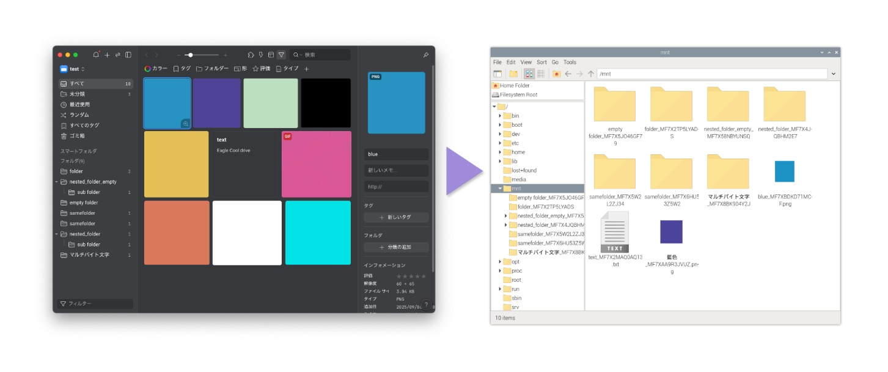

# Eagle cool fuse filesystem




Eagle cool is an image management tool (https://eagle.cool/)

This project is for mounting Eagle cool libraries as a filesystem with FUSE.<br>
Currently, it only supports Linux, but it may also be usable with macFuse and other platforms.

## Install

```
pip3 install -r requirements.txt
```

## Launch

```
python3 eagle_fs.py /mnt
```

If you need to share with daemons like samba, docker etc (you need to allow_user in FUSE)

```
python3 eagle_fs.py /mnt -o allow_other
```

## Stop

```
umount /mnt
```

## Debug

```
python3 eagle_fs.py /mnt -f -d
```

## Unittest

```
python3 -m unittest discover -s tests
```

## Fuse allow user.

By default, FUSE makes files visible only to current user.

To make the file system visible to systems with different running users, such as Samba, Docker, etc., you need to change the FUSE configuration.

```
echo 'user_allow_other' > /etc/fuse.conf
```